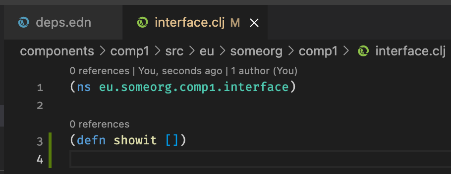
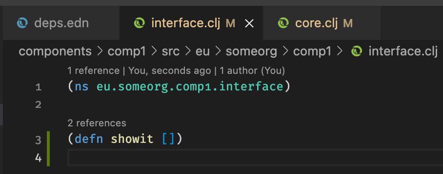

Clojure-LSP with Polylith
=========================

In this repo Clojure-LSP does not seem to work properly. I'll describe two
examples of issues that I observed. I'm using VSCode with Calva, which itself
uses Clojure-LSP under the hood.

Example 1: references are not found
-----------------------------------

Steps:

1. Open repo in vscode
2. Enable the setting "Calva > References Code Lens"
3. Open the file `components/comp1/src/eu/someorg/comp1/interface.clj`
4. Observe that no referenes to `showit` are reported 
5. Open the file `bases/proj1-base/src/eu/someorg/proj1_base/core.clj`
6. Go back to the `interface.clj`
7. Observe that now **two** references to `showit` are reported 

Expected: in step (4) the number of references should have been correct.

Actual: the references were not found.

Example 2: `ns` form in new files
---------------------------------

Steps:

1. Open repo in vscode
2. Create a new file `foo.clj` in `components/comp1/src/eu/someorg/comp1`

Expected: the new file should have namespace form `(ns eu.someorg.comp1.foo)`.

Actual: the new file is empty.

Versions
--------

* clojure-lsp: 2021.11.16-16.52.14
* clj-kondo: 2021.10.20-SNAPSHOT
* nrepl: 0.8.3
* cider-nrepl: 0.26.0
* cider/piggieback: 0.5.2
* Calva: 2.0.225
* Poly: 0.2.13-alpha (2021-10-12)
* VSCode: 1.62.3 (latest)
